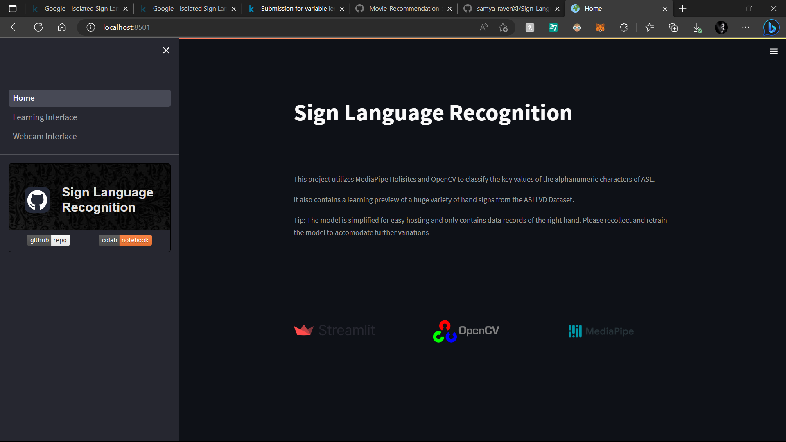

# &#129305; Sign Language Recognition
---

This project utilizes MediaPipe Holisitcs and OpenCV to classify the key values of the alphanumeric characters of ASL. It also contains a learning preview of a huge variety of hand signs from the ASLLVD Dataset.

Tip: The model is simplified for easy hosting and only contains data records of the right hand. Please recollect and retrain the model to accomodate further variations

 
 
 

> For detailed guides, steps and instructions on 'ASLLVD Extraction and Exploration', check out: [Colab Notebook](https://colab.research.google.com/drive/1ZgvceZNj3cT_-OrwEomMa8od80DG2UrX?usp=sharing)

 
 

This streamlit app contains the following sections:
* &#127757; Home: This section contains an overview of all the contents and links to get started.

* &#128214; Learning Interface: This section lets you explore and visualise, a huge collection of hand signs from the ASLLVD Dataset.

* &#128247; Webcam Interface: This section lets you test two models trained on alphanumeric characters of ASL.

 
 

     
     
     
    

    ~ made with ~
    

     
     
    

        

         
         
        

         
         
        

    

